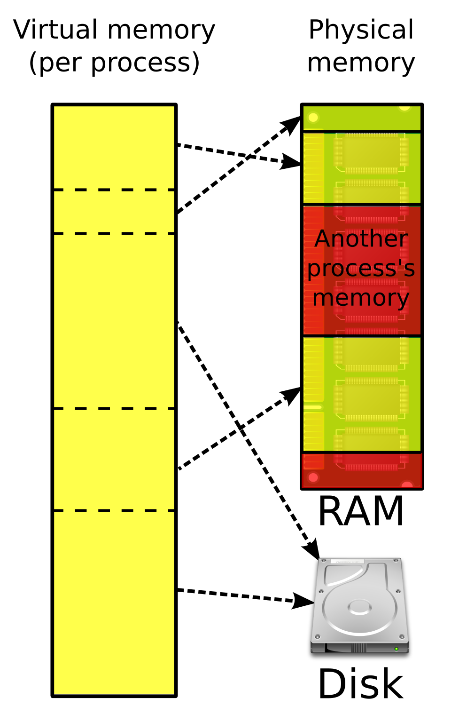

# Виртуальная память.

### Что это такое и зачем нужно?



* **Виртуальная память** — это абстракция, предоставляемая ОС,
которая позволяет процессам работать с памятью как с непрерывным адресным пространством,
независимо от реального расположения данных в физической памяти.

#### Как это выглядит?

```shell
  # Посмотрим на мапу памяти
  cat /proc/$(pgrep example)/maps
```

```text
61213797e000-61213797f000 r--p 00000000 08:02 2282183                    /home/alex/CLionProjects/caos_exam/task_18/example
61213797f000-612137980000 r-xp 00001000 08:02 2282183                    /home/alex/CLionProjects/caos_exam/task_18/example
612137980000-612137981000 r--p 00002000 08:02 2282183                    /home/alex/CLionProjects/caos_exam/task_18/example
612137981000-612137982000 r--p 00002000 08:02 2282183                    /home/alex/CLionProjects/caos_exam/task_18/example
612137982000-612137983000 rw-p 00003000 08:02 2282183                    /home/alex/CLionProjects/caos_exam/task_18/example
61214a310000-61214a331000 rw-p 00000000 00:00 0                          [heap]
7239b7200000-7239b7228000 r--p 00000000 08:02 1051054                    /usr/lib/x86_64-linux-gnu/libc.so.6
7239b7228000-7239b73b0000 r-xp 00028000 08:02 1051054                    /usr/lib/x86_64-linux-gnu/libc.so.6
7239b73b0000-7239b73ff000 r--p 001b0000 08:02 1051054                    /usr/lib/x86_64-linux-gnu/libc.so.6
7239b73ff000-7239b7403000 r--p 001fe000 08:02 1051054                    /usr/lib/x86_64-linux-gnu/libc.so.6
7239b7403000-7239b7405000 rw-p 00202000 08:02 1051054                    /usr/lib/x86_64-linux-gnu/libc.so.6
7239b7405000-7239b7412000 rw-p 00000000 00:00 0 
7239b74f4000-7239b74f7000 rw-p 00000000 00:00 0 
7239b7509000-7239b750b000 rw-p 00000000 00:00 0 
7239b750b000-7239b750d000 r--p 00000000 00:00 0                          [vvar]
7239b750d000-7239b750f000 r--p 00000000 00:00 0                          [vvar_vclock]
7239b750f000-7239b7511000 r-xp 00000000 00:00 0                          [vdso]
7239b7511000-7239b7512000 r--p 00000000 08:02 1051051                    /usr/lib/x86_64-linux-gnu/ld-linux-x86-64.so.2
7239b7512000-7239b753d000 r-xp 00001000 08:02 1051051                    /usr/lib/x86_64-linux-gnu/ld-linux-x86-64.so.2
7239b753d000-7239b7547000 r--p 0002c000 08:02 1051051                    /usr/lib/x86_64-linux-gnu/ld-linux-x86-64.so.2
7239b7547000-7239b7549000 r--p 00036000 08:02 1051051                    /usr/lib/x86_64-linux-gnu/ld-linux-x86-64.so.2
7239b7549000-7239b754b000 rw-p 00038000 08:02 1051051                    /usr/lib/x86_64-linux-gnu/ld-linux-x86-64.so.2
7ffeeace8000-7ffeead09000 rw-p 00000000 00:00 0                          [stack]
ffffffffff600000-ffffffffff601000 --xp 00000000 00:00 0                  [vsyscall]
```

#### **MMU** - Memory Managment Unit

* Устройство, которое на уровне процессора преобразовывает виртуальные адреса в физические.

### Что такое страничная организация памяти, таблицы страниц, как они устроены и где хранятся?

* **Page** - минимальная частица памяти, которая фигурирует в таблице. В большинстве систем ее размер: 4 КБ.
* **Page Table** - на данный момент представляет собой скорее структуру,
похожую на многоуровневую таблицу. Хранит в себе сами страницы, причем состоит из нескольких уровней, как показано на картинке.


### Что такое page fault, в чем отличие minor от major page fault?

**Page Fault** — исключение, возникающее при обращении к виртуальной странице, которая:
- Не отображена на физическую память (но разрешена)
- Запрещена для доступа (например, попытка записи в `read-only` страницу)

Померим число Page Fault`ов для заполняющегося вектора

```shell
  sudo perf stat -e page-faults -p $(pgrep pages_vector) -I 2000
```

Бывает двух типов:
* **Major Page Fault** - загрузка страницы из файла (`swapfile`)
* **Minor Page Fault** - выделение памяти или перестраивание таблицы

Их тоже можно померить при помощи специальной утилиты:

```shell
  sudo perf stat -e dTLB-loads,dTLB-load-misses,iTLB-loads,iTLB-load-misses \
  -p $(pgrep pages_vector) --I 2000
```

### Что такое TLB cache?

**TLB** — это аппаратный кэш внутри процессора для ускорения преобразования виртуальных адресов в физические.

* `TLB Hit` - угадали адрес (он находится в TLB)
* `TLB Miss` - не нашли адрес в TLB, будем искать напрямую в Page Table


### В какой ситуации возникает ошибка `Segmentation fault` и что в этой ситуации происходит на уровне ОС и процессора?

`SEGFAULT` возникает, если после Page Fault'а ОС обнаруживает, что мы пытаемся получить доступ к запрещенной 
странице (обращение к `NULL` или нарушение прав `rwx`)
