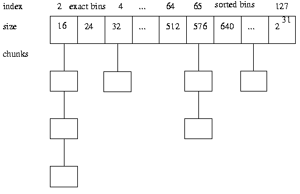
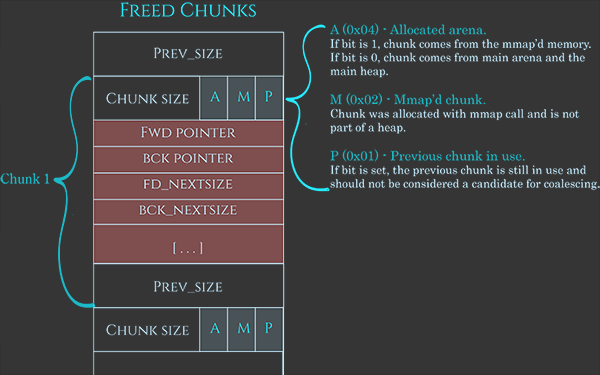
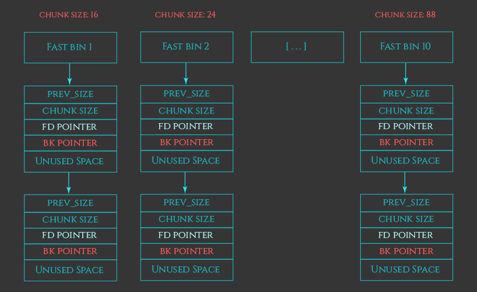

## Как реализованы функции malloc и free в стандартной библиотеке Си?

* `mmap` и `brk`
* Бакеты
* `MMAP_THRESHOLD`
* Структура чанков

## Расскажите про механизм бакетов, малые и большие бакеты.

* #### Как malloc выбирает, какой бакет использовать?

## Структура чанка

* _Note_: `PREV_SIZE` присутствует только у свободных бакетов. Это нужно для консолидации.

## Как происходит освобождение бакетов и слияние соседних свободных бакетов?

* Командой `free`, после этого чанк помещается в список свободных чанков.
* Слияние происходит с чанком, который расположен рядом в списке, после чего увеличивается размер

## Что такое fastbins? 

* **Fastbins:** односвязные списки для очень мелких освобождённых чанков (не сразу сливаются для ускорения повторных аллокаций)

