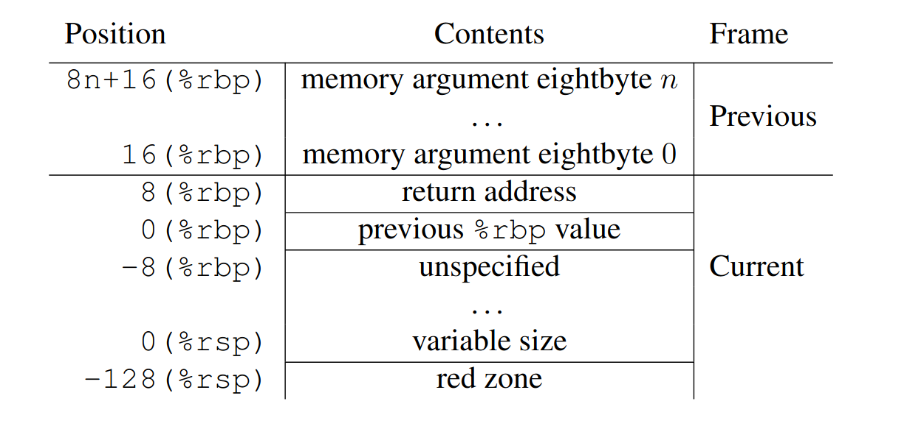

# Инструкции `call` и `ret`.

* `call` - вызов функции
  * Сохраняет адрес возврата — помещает адрес следующей за call инструкции в стек
  * Переходит по указанному адресу — передаёт управление вызываемой функции
* `ret` - возврат из функции
  * Извлекает адрес возврата — достаёт значение из стека
  * Переходит по этому адресу — возвращает управление вызывающей функции

## Что такое стековый фрейм?

**Стековый фрейм** (также активационная запись, кадр стека) — это область на стеке, которая содержит всю информацию,
необходимую для выполнения конкретного вызова функции.

### Что такое `stack pointer` и `base pointer`, регистры `rbp` и `rsp`?

#### Стек растёт вниз (к младшим адресам).
- `rsp` (stack pointer) — указывает на вершину стека.
- `rbp` (base pointer) — указывает на начало текущего стекового фрейма.
- `red zone` — область памяти размером 128 байт ниже `rsp`, которую функция может использовать без явного выделения на стеке для своих нужд.

## Что происходит на уровне ассемблера при вызове функций и при возврате из них?

## Где хранятся аргументы функций при вызове?

В архитектуре `x86-64` и для `System V AMD64 ABI` следующие правила:
* Первые 6 целых аргументов хранятся в регистрах - остальные на стеке
* Первые 8 вещественных аргументов - в регистрах, а остальные на стеке

## Где хранится результат функции сразу после вызова?

Это зависит от типа значения:
* Целые числа до 64-bit - `RAX` или `EDX`
* Целые 128-bit - `	RDX:RAX`
* float/double - `XMM0`
* Структуры ≤ 16 байт - `RAX` или `EAX`
* Структуры > 16 байт - в памяти (указатель)

##  Что делает флаг компиляции `-fno-omit-frame-pointer`, зачем он нужен?

- Запрещает использовать `rbp` как регистр общего назначения.
- Упрощает отладку, но слегка замедляет код.
