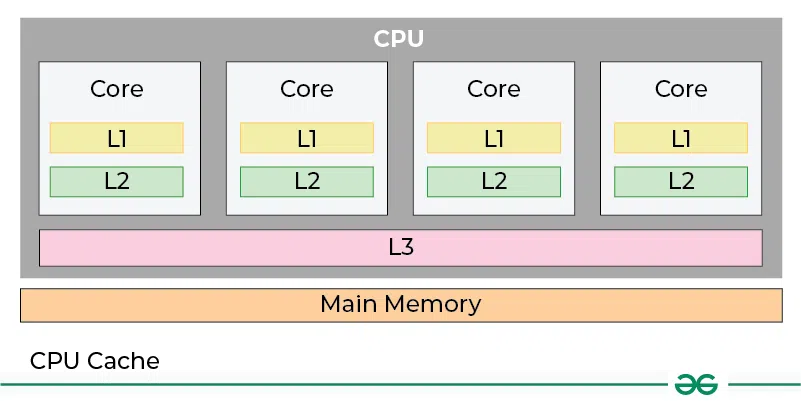

# Кэши процессора. 

## Сколько уровней кэша есть в процессоре, зачем они нужны?

Всего есть 3 уровня кэша:
* L1 - самый близкий, можно быстро получить данные, но хранить их можно немного (32-64 КБ) 
* L2 - уже чуть подольше, будем искать в нем данные, если не нашли в L1, можно хранить до 1 Мб
* L3 - еще больше данных. Кэш уже для всего процессора, хранит до 32МБ данных



## Как узнать размеры кэшей своего процессора?

```shell
  # lscpu
  lscpu | grep -i cache
```

```shell
  # getconf
  getconf -a | grep CACHE
```

## Что такое кэш-линия?

**Кэш-линия** — это блок фиксированного размера (обычно 64 байта в современных `x86/x86-64` процессорах), который:
* Перемещается между уровнями памяти (RAM ↔ L3 ↔ L2 ↔ L1)
* Является атомарной единицей загрузки/выгрузки в кэш
* Имеет собственный адрес в памяти и состояние в кэш-иерархии

## Почему делать обход матрицы по строкам эффективнее, чем по столбцам?

* Это связано с тем, что у нас подгружается не какое-то конкретное значение, а блок определенного 
размера.

#### Покажем на примере

```shell
  g++ vert_matrix.cpp -o vert_matrix
  g++ horiz_matrix.cpp -o horiz_matrix
```

```shell
  time ./horiz_matrix
```

```shell
  time ./vert_matrix
```
